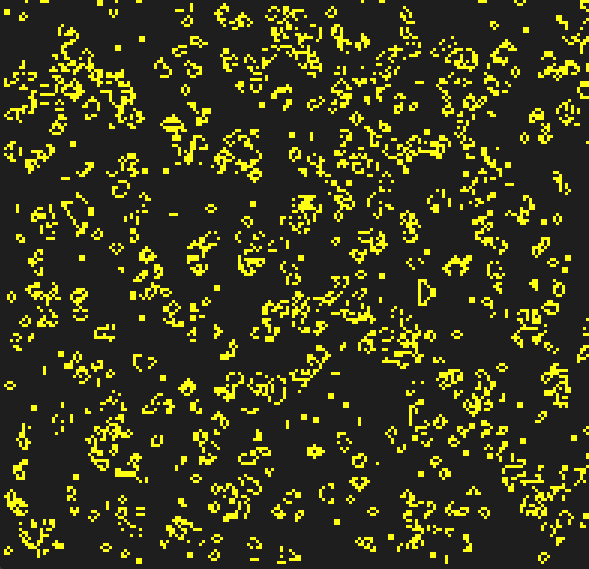
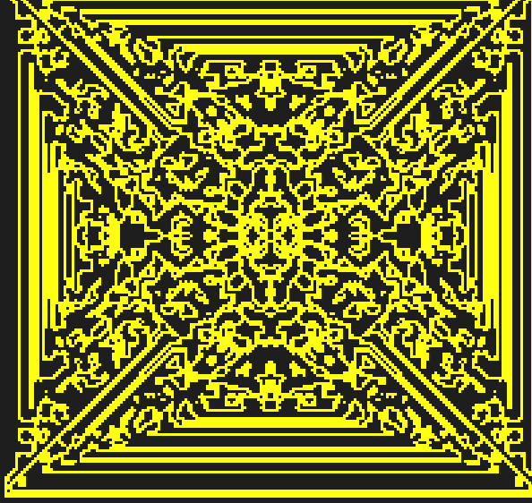
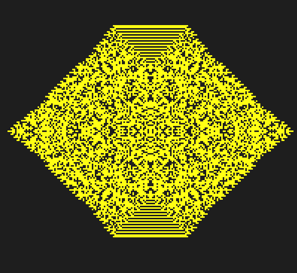

# PROG1_Celicni_avtomati

Implementacja dvodimenzionalnih celičnih avtomatov. Program omogoča simulacijo igre življenja ter določanje novih variant celičnih avtomatov na podlagi tipa okolice posamezne celice in števila živih celic med njimi.
Dvodimenzionalni celični avtomat je diskretni model računanja na mreži celic. Vsaka celica je lahko živa ali mrtva. V vsaki iteraciji modela posodobimo stanje celice na podlagi njenih sosedov. Presenetljiva lastnost teh modelov je, da preprosta pravila povzoročijo kompleksne oblike vedenja ter vzorcev med celicami. Osnovna ideja je podrobneje opisana na [Cellular Automata](https://en.wikipedia.org/wiki/Cellular_automaton).

## Implementacija
Ker v vsaki iteraciji potrebujemo informacijo o sosedah trenutne celice, sem se odločil, da predstavim mrežo celic z indeksirano mapo. To omogoča, da dostopamo do sosedov v konstantem času, brez ponavljajočega računanja.  
Potek programa je sledeč:
* Na podlagi tekstovnega vmesnika, določimo parametre simulacije. Določimo tip celic, velikost simulacije in inicializacijo začetne mreže.
* Inicializiramo grafični prikaz.
* Generiramo začetno mrežo.
* Zaženemo simulacijo, ki vsebuje:
  * Prikaz mreže na zaslon
  * Posodobitev mreže

Program se izvaja dokler ni zaznan poljubna aktivnost na tipkovnici. 

Sosede robnih celic obravnavam kot mrtve celice. Pri implementaciji sem uporabil samo '.ml' datoteke, ker moduli potrebujejo vso vsebino ostalih modulov. Dodatni komentarji o implementaciji so dostopni v izvirni kodi, kjer so opisani tudi vsi uporabljeni tipi.

## Uporaba
Za grafični prikaz potrebujemo [modul graphics](https://github.com/ocaml/graphics). Naložimo ga z ukazom `opam install graphics`.

Uporabnik lahko spreminja nastavitve preko tekstovnega vmesnika. Njegova uporaba je opisana z ukazom `dune exec --"ime_projekta" -help`.

## Primeri
|  | 
|:--:| 
| Igra življenja -> `dune exec -- CA -regular` |
|  | 
| Moorova okolica -> `dune exec -- CA -regular -seed_size 10 -live_count 1 2 0 0 0 0 0 0  -module Moore` |
|  | 
| Neumannova okolica -> `dune exec -- CA -regular -seed_size 50 -live_count 1 4 0 0 0 0 0 0  -module Neumann` |
